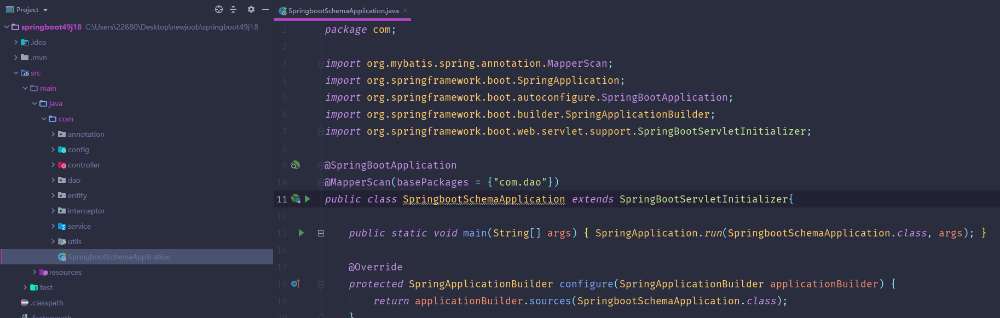
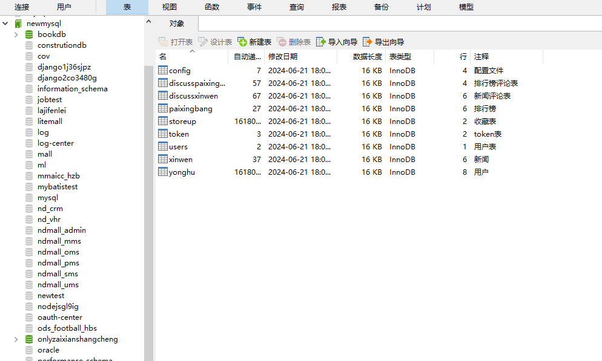
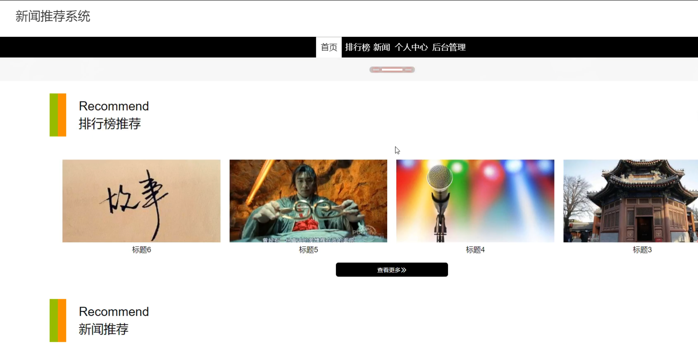
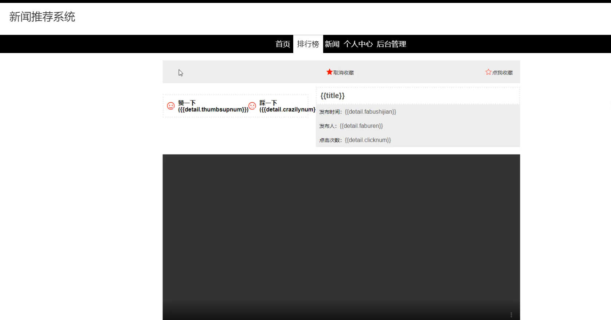
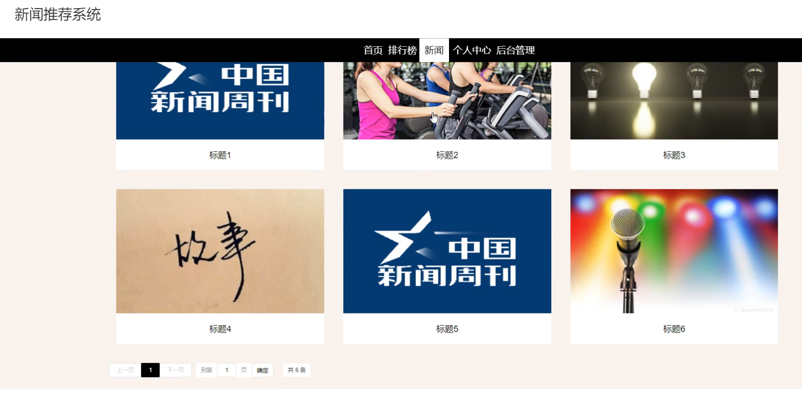
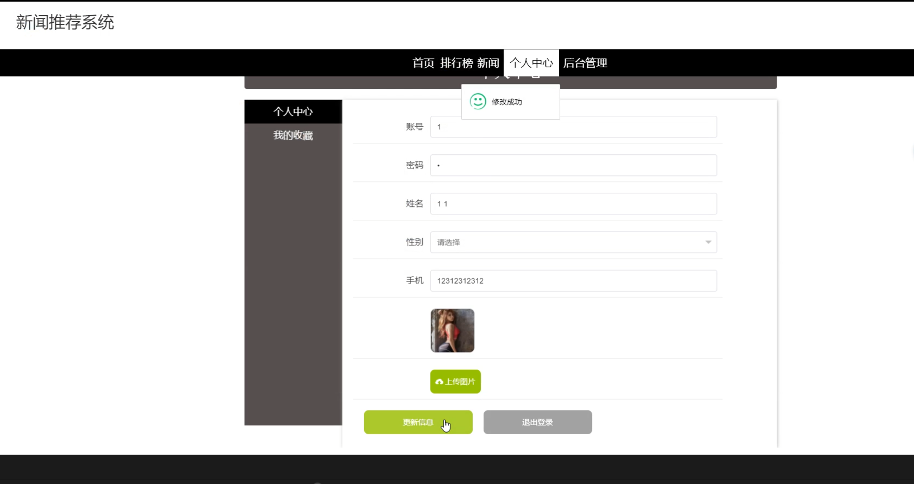
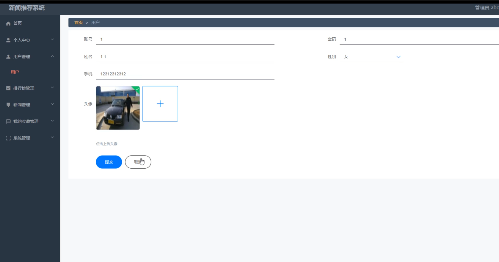
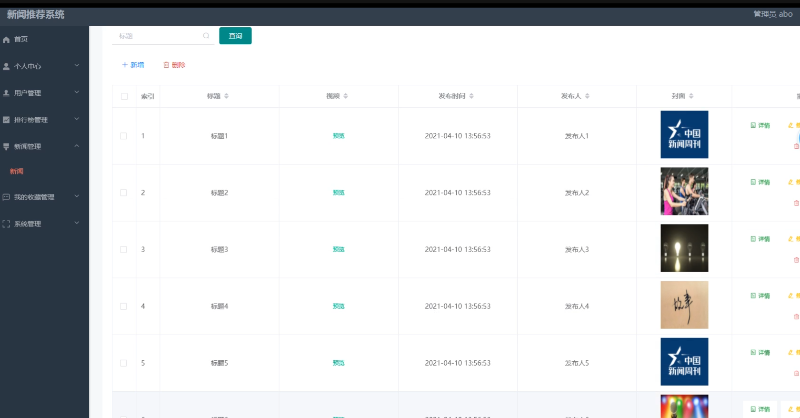
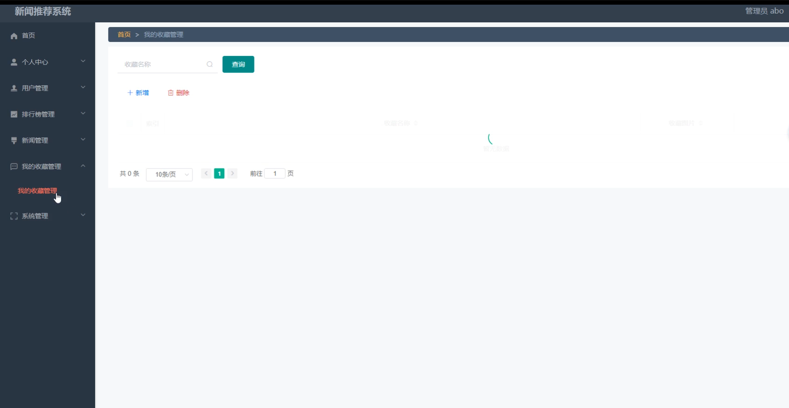
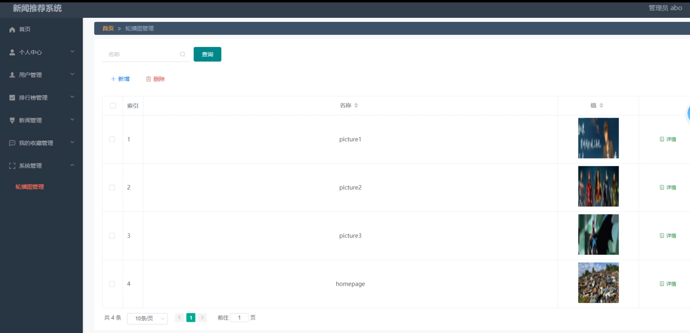

# 基于springboot的新闻推荐系统

---
### 👉作者QQ ：1556708905 微信：zheng0123Long (支持定制修改、部署调试、定制毕设)

### 👉接网站建设、小程序、H5、APP、各种系统等

---

#### 介绍

基于Spring Boot的新闻推荐系统旨在应对当前信息过载的挑战，为用户提供个性化的新闻阅读体验。在数字化时代，新闻来源繁杂，用户难以从海量信息中筛选出感兴趣的内容。传统新闻推荐系统虽能一定程度上缓解这一问题，但在用户行为分析、内容语义理解等方面仍存在局限。因此，本系统将利用先进的推荐算法和Spring Boot框架，构建高效、准确的新闻推荐系统，以满足用户的个性化需求。

#### 技术栈

后端技术栈：Springboot+Mysql+Maven

前端技术栈：Vue+Html+Css+Javascript+ElementUI

开发工具：Idea+Vscode+Navicate

#### 系统功能介绍

管理员角色功能模块  
个人中心：管理员可以在个人中心查看和编辑个人信息，包括修改密码和更新联系方式，确保个人信息的准确性。  
用户管理：管理员可以管理系统中的用户信息，包括新增、修改、删除用户，分配用户权限，确保用户信息的及时更新和准确。  
排行榜管理：管理员可以管理新闻排行榜，设置和调整新闻的排行规则，确保排行榜内容的公正和合理。  
新闻管理：管理员可以管理新闻信息，包括新增、修改、删除新闻，审核新闻内容，确保新闻信息的准确和及时发布。  
我的收藏管理：管理员可以查看和管理用户的收藏新闻，分析用户偏好，为新闻推荐算法提供数据支持。  
系统管理：管理员可以对系统参数进行设置和管理，包括安全设置、日志管理和数据备份，确保系统的稳定和安全运行。  

用户角色功能模块  
排行榜：用户可以查看新闻排行榜，了解当前热门新闻，提高阅读的趣味性和信息获取的效率。  
新闻：用户可以浏览和阅读系统推荐的新闻内容，根据个人兴趣获取个性化的新闻推荐，提高阅读体验。  
个人中心：用户可以在个人中心查看和编辑个人信息，包括修改密码和更新联系方式，管理个人收藏的新闻，确保个人信息的准确性。  
后台管理中的个人信息：用户可以通过后台管理查看和管理个人信息，确保个人数据的安全和隐私。  

#### 系统作用

对管理员的作用  
高效管理用户：通过用户管理模块，管理员可以便捷地管理用户信息，确保平台用户的规范和安全。  
新闻内容管理：通过新闻管理模块，管理员可以高效地管理新闻内容，确保新闻信息的准确和及时发布。  
排行榜管理：管理员可以通过排行榜管理模块，合理设置新闻排行规则，提供公正和热门的新闻内容。  
系统安全维护：通过系统管理模块，管理员可以进行系统参数设置、安全设置和数据备份，确保系统的稳定和安全运行。  

对用户的作用  
获取个性化新闻：通过新闻模块，用户可以根据个人兴趣获取个性化的新闻推荐，提高阅读体验。  
查看热门新闻：通过排行榜模块，用户可以了解当前热门新闻，提高信息获取的效率。  
管理个人信息：通过个人中心模块，用户可以查看和管理个人信息和收藏新闻，确保个人数据的安全和隐私。  

#### 系统功能截图

代码结构

数据库表

登录

首页

排行榜

新闻

个人中心

管理端用户管理

新闻管理

我的收藏管理

系统管理

#### 总结

基于SpringBoot的新闻推荐系统通过角色分工和功能模块的设计，实现了新闻内容的高效管理和个性化推荐。管理员可以通过系统高效管理用户和新闻内容，确保平台的稳定运行和内容的公正性；用户则可以通过系统获取个性化新闻推荐，提升阅读体验和信息获取的效率。该系统不仅提高了新闻推荐的准确性和用户的满意度，也为新闻平台的运营提供了有力支持。

#### 使用说明

创建数据库，执行数据库脚本 修改jdbc数据库连接参数 下载安装maven依赖jar 启动idea中的springboot项目

后台地址：http://localhost:8080/springboot49j18/admin/dist/index.html

管理员  abo 密码 abo

前台地址：http://localhost:8080/springboot49j18/front/index.html

